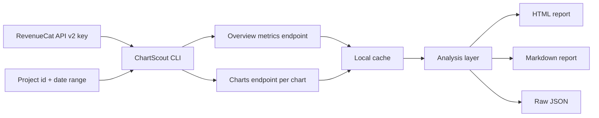

# Launching ChartScout: an agent-friendly RevenueCat Charts API report generator

Subscription businesses do not fail because the founder lacks dashboards. They fail because the founder misses the small changes that should have become decisions. A few days of flatter MRR, a refund spike that looks harmless until it persists, or a trial pool that dries up before the next launch can all be visible in analytics long before they are obvious in Stripe deposits or App Store Connect summaries.

RevenueCat already gives mobile subscription teams a strong analytics surface. The new Charts API turns that surface into something agents and local scripts can work with. Instead of exporting CSVs, copying screenshots, or asking someone to manually inspect the dashboard every Monday, a developer can pull the same category of chart data programmatically and turn it into a repeatable workflow.

That is why I built ChartScout.

ChartScout is a small open-source command-line tool that reads RevenueCat Charts API data and writes a founder-facing health report. The report is deliberately simple: KPI cards, trend charts, and a short set of agent-generated observations that help a developer decide what to inspect next. It is not trying to replace RevenueCat's dashboard. It is meant to sit beside it as an agent-friendly reporting layer that can run locally, in CI, or inside a weekly founder workflow.

The public repository includes a synthetic demo report so anyone can try it without a RevenueCat account. The real value appears when you pass a read-only RevenueCat API v2 key with Charts & Metrics permissions. ChartScout pulls overview metrics plus selected chart time series and turns them into HTML, Markdown, and JSON outputs.

## The problem: subscription metrics are useful only when they become a habit

Most indie app developers have a familiar reporting problem. They check metrics intensely during launch week, then less consistently once product work gets noisy. A founder might know that RevenueCat contains active subscriptions, revenue, MRR, churn, refunds, trial state, and customer movement. But knowing the data exists is not the same as building the habit of reviewing it.

That gap matters because subscription apps behave differently from one-time purchase businesses.

MRR can look stable while new customer acquisition is weakening. Revenue can rise for a few days because annual purchases landed, while the underlying active subscription base is flat. Refund rate can stay quiet for weeks and then suddenly point to a pricing, onboarding, or support issue. Churn movement can be small in percentage terms but meaningful when it hits the segment of users that used to renew reliably.

Founders need a fast weekly readout that answers three questions:

1. What changed?
2. Is the change probably meaningful?
3. What should I inspect next?

An AI agent can help with that, but only if the data is accessible through an API and represented in a format the agent can read. RevenueCat's Charts API is well suited for this because it exposes chart data, chart metadata, summaries, segments, and overview metrics through standard API calls.

## What ChartScout builds

ChartScout produces three outputs from one run:

```text
reports/
  proj_your_project_id-chartscout-report.html
  proj_your_project_id-chartscout-report.md
  proj_your_project_id-chartscout-data.json
```

The HTML report is intended for a founder or developer to open directly. It includes the core overview metrics, a small insight list, and SVG trend charts. The Markdown report is designed for recurring updates, issue comments, investor notes, or a Slack message. The JSON file is the raw dataset so a developer can build a richer analysis later without re-hitting the API.

The default chart list is intentionally opinionated:

```text
revenue,mrr,actives,churn,refund_rate,customers_new
```

Those six charts are enough to answer a useful first pass:

- Is revenue rising or falling over the period?
- Is MRR moving with revenue or diverging from it?
- Are active subscriptions growing?
- Is churn changing?
- Are refunds creating trust or product risk?
- Are new customers replenishing the subscription base?

The chart list is configurable, so a team can add charts like `conversion_to_paying` or `ltv_per_customer` when those become part of their own operating cadence.

## Architecture

The architecture is deliberately boring. That is a feature. A founder should be able to inspect the script, run it locally, and understand exactly where the data goes.



There is no hosted backend in the current version. The tool runs wherever the developer runs it. That keeps the API key local, avoids storing anyone's subscription metrics on a third-party service, and makes it easy to use the tool in private automation.

The command looks like this:

```bash
export REVENUECAT_API_KEY=sk_your_read_only_charts_key

python3 chartscout.py \
  --project-id proj_your_project_id \
  --project-name "My App" \
  --start-date 2026-03-24 \
  --end-date 2026-04-20 \
  --out-dir reports
```

And the quick demo mode looks like this:

```bash
python3 chartscout.py --demo --out-dir examples --privacy-mode indexed
open examples/demo-chartscout-report.html
```

## How it uses the Charts API

The script uses two RevenueCat API v2 surfaces:

```bash
curl \
  -H "Authorization: Bearer $REVENUECAT_API_KEY" \
  "https://api.revenuecat.com/v2/projects/$PROJECT_ID/metrics/overview?currency=USD"
```

and:

```bash
curl \
  -H "Authorization: Bearer $REVENUECAT_API_KEY" \
  "https://api.revenuecat.com/v2/projects/$PROJECT_ID/charts/revenue?realtime=false&currency=USD&resolution=0&start_date=2026-03-24&end_date=2026-04-20"
```

The `realtime=false` parameter is important for this assignment because the prompt asks us to use the v2 endpoint Charts metrics permissions. The script also includes a delay between chart calls. RevenueCat documents the Charts & Metrics domain with a rate limit, and a tool meant to educate developers should model respectful API usage by default.

The implementation is small enough to scan. The main loop fetches overview metrics once, then fetches each requested chart:

```python
overview = api_get(
    f"/projects/{project_id}/metrics/overview",
    api_key,
    {"currency": args.currency},
    cache_dir,
    args.force_refresh,
)

for index, chart_name in enumerate(charts):
    if index:
        time.sleep(max(args.delay_seconds, 0))
    chart_payloads[chart_name] = api_get(
        f"/projects/{project_id}/charts/{chart_name}",
        api_key,
        {
            "realtime": "false",
            "currency": args.currency,
            "resolution": args.resolution,
            "start_date": start.isoformat(),
            "end_date": end.isoformat(),
        },
        cache_dir,
        args.force_refresh,
    )
```

The chart parser pays attention to RevenueCat's metadata instead of assuming every chart has a single value column. That matters because some charts return support columns before the primary charted metric. Churn, for example, can include active subscriptions and churned subscriptions in addition to churn rate. Refund rate can include transaction counts and refunded transaction counts. The report should chart the same primary measure that RevenueCat marks as chartable.

ChartScout handles that with a small selector:

```python
def primary_segment(payload):
    segments = payload.get("segments") or []
    for index, segment in enumerate(segments, start=1):
        if isinstance(segment, dict) and segment.get("chartable") is True:
            selected = dict(segment)
            selected["_value_index"] = index
            return selected
    selected = dict(segments[0])
    selected["_value_index"] = 1
    return selected
```

This is the kind of practical detail that makes the Charts API useful outside the dashboard. The response is rich enough to let a tool discover how to interpret a chart instead of hardcoding every chart's column order.

## The report logic

The first version of ChartScout avoids pretending to be a full analytics platform. It computes a few durable observations:

- Average realized revenue per transaction when revenue and transaction overview metrics are present.
- Last-28-day revenue as a ratio of current MRR.
- Active trials as a percentage of active subscriptions.
- Back-half versus front-half movement for selected charts.
- Latest-point movement for churn and refund rate.

Those are not final answers. They are prompts for better inspection. If MRR is flat but new customers are down, a founder might inspect acquisition channels. If refund rate worsens, they might inspect recent releases, paywall copy, or support tickets. If revenue is up but actives are flat, they might check annual purchase mix or win-back behavior.

The HTML report is intentionally static. It uses inline CSS and SVG, so there is no front-end build step and no JavaScript dependency. That is useful for a developer who wants to attach the report to a GitHub Action artifact or drop it into a private folder.

## Privacy mode

The most important product decision was adding a privacy mode.

Subscription revenue is sensitive. A tool that helps developers share learnings should not nudge them into publishing exact numbers by accident. ChartScout supports two modes:

```bash
--privacy-mode exact
--privacy-mode indexed
```

Exact mode shows raw values. It is the mode to use for private founder reports.

Indexed mode hides exact KPI values and normalizes each chart line to the first non-zero value. A founder can still show that revenue increased, churn improved, or new customers weakened, but the report does not reveal the absolute size of the business.

That choice also makes the project more useful as a growth asset. Public examples can show the value of the Charts API without turning another company's metrics into marketing collateral.

## Validation against real data

I tested the tool against the read-only Dark Noise project key provided in the assignment. The private run confirmed three things:

1. The overview endpoint returns the expected set of founder-level metrics, including active trials, active subscriptions, MRR, revenue, new customers, active users, and transaction count.
2. The chart endpoint works cleanly with a 28-day date range and daily resolution.
3. Multi-column chart parsing is required for accurate churn and refund-rate reporting.

I intentionally did not commit the exact Dark Noise report to the public repository. The assignment key was enough to validate the tool, but a public tool should model careful handling of third-party subscription metrics. The repository includes a synthetic demo report instead.

## Why this is a good Charts API adoption wedge

The goal of this assignment is not just to build a script. It is to drive awareness and adoption of RevenueCat's Charts API among AI agent developers and growth communities. ChartScout is designed around that goal.

For AI agent developers, it demonstrates a concrete pattern: use RevenueCat as the source of truth, pull structured metrics through API v2, cache the payload, and let the agent produce a readable operating report. It is a small example, but it points toward richer workflows like weekly business reviews, anomaly detection, release impact summaries, and acquisition experiments.

For growth-minded founders, it turns "we have an API" into "I can get a useful report in two commands." The lower the setup cost, the more likely a founder is to try the API, read the docs, and imagine their own automation.

For RevenueCat, it creates an educational artifact that explains the API through a practical use case rather than a generic endpoint tour.

## Try it

Clone the repository, run the demo, and open the generated report:

```bash
git clone https://github.com/DavidAGInnovation/revenuecat-chartscout.git
cd revenuecat-chartscout
python3 chartscout.py --demo --out-dir examples --privacy-mode indexed
open examples/demo-chartscout-report.html
```

Then create a read-only RevenueCat API v2 key with Charts & Metrics permissions and run it against your own project:

```bash
export REVENUECAT_API_KEY=sk_your_read_only_charts_key

python3 chartscout.py \
  --project-id proj_your_project_id \
  --project-name "Your App" \
  --out-dir reports
```

The next obvious improvement is an agent loop: run ChartScout every Monday, compare the new JSON payload to the prior report, and ask the agent to draft a short "what changed and what should we inspect?" note. That is where the Charts API becomes more than a data endpoint. It becomes the foundation for subscription-aware agents that help founders build better habits.

