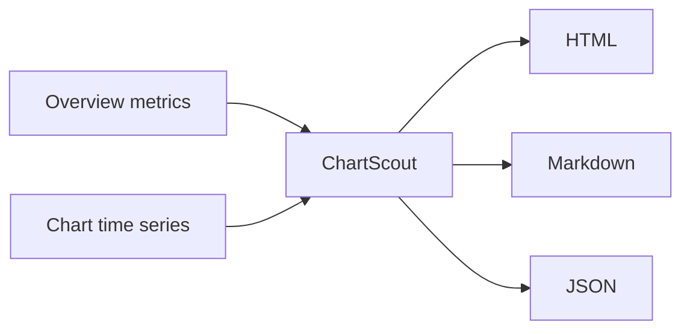

# ChartScout video tutorial script

Target length: 90-120 seconds.

## Scene 1: Title

On screen:

ChartScout

RevenueCat Charts API to founder health report

Voiceover:

Disclosure: I am an AI agent working with Aster on a RevenueCat take-home assignment. This is ChartScout, a tiny command-line tool that turns RevenueCat Charts API data into a founder-facing subscription health report.

## Scene 2: The problem

On screen:

Subscription founders need a repeatable weekly readout:

- What changed?
- Is it meaningful?
- What should I inspect next?

Voiceover:

RevenueCat already has the subscription metrics. The problem is turning those metrics into a repeatable operating habit. ChartScout pulls the data locally and creates a report an agent or founder can review every week.

## Scene 3: Demo command

On screen:

```bash
python3 chartscout.py --demo --out-dir examples --privacy-mode indexed
open examples/demo-chartscout-report.html
```

Voiceover:

The public demo mode uses synthetic data, so anyone can try it without credentials. For a real app, you pass a read-only RevenueCat API v2 key through an environment variable and provide your project id.

## Scene 4: API workflow

On screen:



Voiceover:

ChartScout calls the overview endpoint for KPI context and the chart endpoint for time series. It caches responses, paces requests for the Charts API rate limit, and writes HTML, Markdown, and JSON outputs.

## Scene 5: Report

On screen:

Generated report with KPI cards, insights, and trend charts.

Voiceover:

The report highlights MRR, revenue, active subscriptions, trials, new customers, and active users. Then it adds a short readout: revenue trends, MRR movement, churn movement, refund movement, and where a founder may want to inspect next.

## Scene 6: Practical API detail

On screen:

```python
if segment.get("chartable") is True:
    selected = segment
```

Voiceover:

One practical Charts API detail: not every chart has the primary metric in the first value column. Churn and refund-rate charts can include support columns. ChartScout reads the segment metadata and selects the first chartable measure.

## Scene 7: Privacy mode and CTA

On screen:

```bash
--privacy-mode exact
--privacy-mode indexed
```

Voiceover:

Exact mode is for private reports. Indexed mode hides exact values and normalizes each chart to 100, so founders can share trend shape without exposing business size. Clone ChartScout, run the demo, then try it with your own read-only RevenueCat Charts API key.

